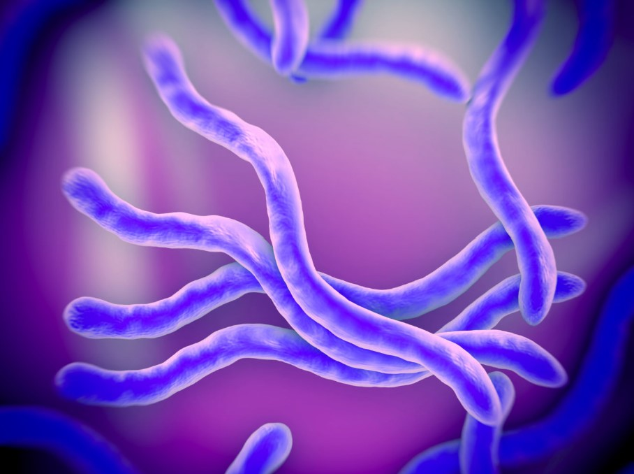

# Part I

## Image of bacteria


## Link to Borrelia burgdorferi Wikipedia page
[Borrelia burgdorferi Wikipedia page](https://en.wikipedia.org/wiki/Borrelia_burgdorferi)

## Import Sequences.csv
```{r}
Sequences=read.csv("Sequences.csv")
```

## Print out each sequence
```{r}
print(Sequences$Sequence)
```

## Count number of each base pair
```{r}
Sequences$Sequence=as.factor(Sequences$Sequence)

A=c()
Th=c()
C=c()
G=c()
ABP=c()
TBP=c()
CBP=c()
GBP=c()


for (i in 1:length(Sequences$Sequence)) {
 A[i]=gsub("T|C|G", "", Sequences$Sequence[i])
 Th[i]=gsub("A|C|G", "", Sequences$Sequence[i]) 
 C[i]=gsub("A|T|G", "", Sequences$Sequence[i])
 G[i]=gsub("A|T|C", "", Sequences$Sequence[i])

ABP[i]=nchar(A[i])
TBP[i]=nchar(Th[i])
CBP[i]=nchar(C[i])
GBP[i]=nchar(G[i])
 }
```


## Table with number of each nucleotide
```{r}
Tab=matrix(nrow=4, ncol = 3)
Tab[1,]=ABP
Tab[2,]=TBP
Tab[3,]=CBP
Tab[4,]=GBP
colnames(Tab)=c("HQ433692.1","HQ433694.1", "HQ433691.1")
rownames(Tab)=c("A","Th","C", "G")

print(Tab)
```


GC content of nucleotides
```{r}
BP1=nchar(as.character(Sequences$Sequence[1]))
BP2=nchar(as.character(Sequences$Sequence[2]))
BP3=nchar(as.character(Sequences$Sequence[3]))

GC1=((CBP[1]+GBP[1])/BP1)*100
GC2=((CBP[2]+GBP[2])/BP2)*100
GC3=((CBP[2]+GBP[2])/BP3)*100

Tab=matrix(nrow=3, ncol = 2)
Tab[1,]=c("HQ433692.1", GC1)
Tab[2,]=c("HQ433694.1", GC2)
Tab[3,]=c("HQ433691.1", GC3)
colnames(Tab)=c("Sequence ID", "GC Content")

print(Tab)
```

